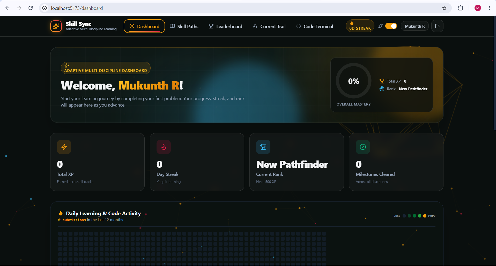
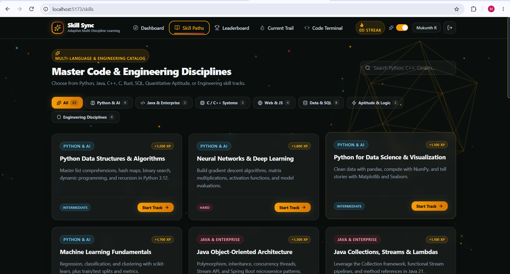
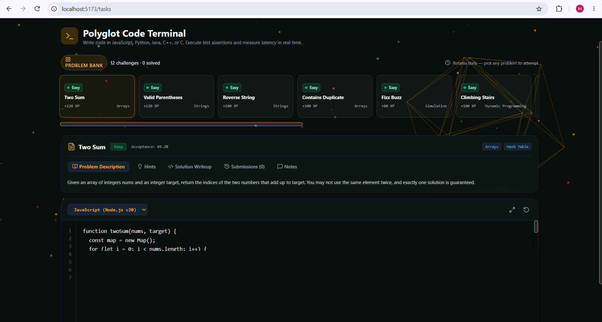
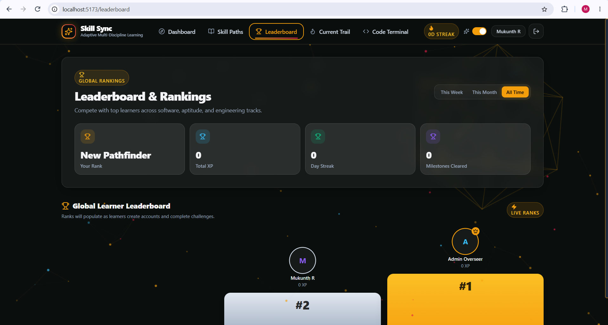
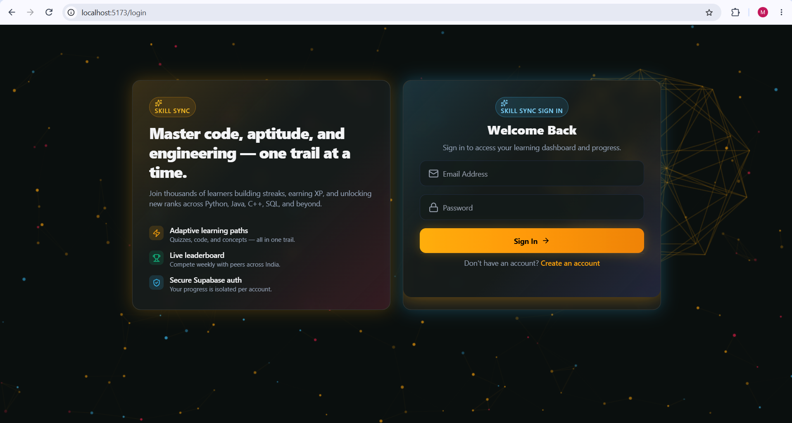

<div align="center">

# SkillSync

### A trackable learning platform for mastering technical skills

[](https://opensource.org/licenses/MIT)
[](https://www.oracle.com/java/)
[](https://spring.io/projects/spring-boot)
[](https://react.dev/)
[](https://www.typescriptlang.org/)
[](https://vitejs.dev/)
[](https://www.mysql.com/)
[](https://jwt.io/)

A full-stack learning platform that turns curated learning paths and coding challenges into a gamified, trackable experience. Earn XP, build streaks, climb the leaderboard, and master real skills through hands-on practice.

[Features](#-features) · [Tech Stack](#-tech-stack) · [Screenshots](#-screenshots) · [Quick Start](#-quick-start) · [API](#-api) · [Project Structure](#-project-structure) · [Roadmap](#-roadmap) · [Author](#-author)

</div>

---

## 📸 Screenshots


<div align="center">

### Dashboard — your stats at a glance



### Learning Path — milestones + polyglot code editor



### Code Editor — write, run, and test in 5 languages



### Leaderboard — see where you stand



### Admin Dashboard — manage users and content



</div>

---

## ✨ Features

### 🎯 Curated Learning Paths
- **Skill catalog** organized by category (Frontend, Backend, Systems, Data, etc.)
- **Multi-milestone paths** with progressive difficulty (Beginner → Intermediate → Advanced)
- **Self-paced** — start, pause, and resume any path at any time

### 💻 Polyglot Code Editor
- **In-browser code execution** for JavaScript, Python, Java, C++, and C
- **Starter code** pre-loaded for every supported language
- **Built-in test cases** with pass/fail feedback and runtime metrics (time, memory)
- **Submission history** so you can review past attempts and learn from mistakes

### 📈 Gamification
- **XP and level progression** — every completed task and milestone grants XP
- **Daily streaks** — show up every day to keep your streak alive
- **Achievement-style progression** — track which milestones you've completed across all paths
- **Personal stats dashboard** — see your total XP, level, streak, and recent activity

### 🏆 Leaderboard
- **Three time ranges**: weekly, monthly, and all-time
- **Public ranking** — see where you stand among the community
- **Tied to XP** — the more you ship, the higher you climb

### 🛠️ Admin Dashboard
- **User management** — list, suspend, or reactivate any account
- **XP grants** — manually award XP for special achievements
- **Reset progress** — wipe a user's stats without deleting their account
- **Content creation** — add new skills, paths, and code tasks

### 🔐 Secure by Default
- **JWT authentication** (HS256) with 24-hour token TTL
- **BCrypt password hashing** (Spring Security default)
- **Role-based access control** — `STUDENT` and `ADMIN` with different permissions
- **CORS configured** for the local Vite dev server

---

## 🧰 Tech Stack

| Layer | Technology |
|---|---|
| **Frontend** | React 19, TypeScript 5.9, Vite 7, TailwindCSS 4, Framer Motion, Three.js, React Router 7, Lucide Icons |
| **Backend**  | Spring Boot 3.3.5, Spring Security, Spring Data JPA, Hibernate, Jakarta Validation, jjwt 0.12 |
| **Database** | MySQL 8 with Hibernate auto-DDL |
| **Auth**     | JWT (HS256) + BCrypt password hashing |
| **Build**    | Maven (with `mvnw` wrapper) for backend, pnpm/npm for frontend |
| **Deploy**   | Vercel-ready frontend, Spring Boot fat-jar backend |

---

## 🚀 Quick Start

### Prerequisites

- **Java 21** or newer
- **Maven** (or use the bundled `mvnw` wrapper)
- **MySQL 8** running on `localhost:3306`
- **Node.js 20+** and **pnpm** (or **npm**)

### 1. Clone the repo

```bash
git clone https://github.com/Mukunth1/skillsync.git
cd skillsync
```

### 2. Create the database

```bash
mysql -u root -p -e "CREATE DATABASE skillsync CHARACTER SET utf8mb4;"
```

### 3. Start the backend

```bash
cd backend
./mvnw spring-boot:run
```

The API will start on **http://localhost:8080/api**. On first boot, a `DataSeeder` populates the catalog (skills, paths, milestones, code tasks) from JSON files in `src/main/resources/data/` and creates the default admin user.

### 4. Start the frontend

In a new terminal:

```bash
npm install
npm run dev
```

The Vite dev server will start on **http://localhost:5173** and proxy API calls to the backend via the URL in `.env.local`.

### 5. Open the app

Visit **http://localhost:5173** in your browser.

### Default admin (created on first backend boot)

| Field | Value |
|---|---|
| **Email** | `admin@skillsync.edu` |
| **Password** | `admin123` |

> ⚠️ **Change these immediately** for any non-local environment by setting `BOOTSTRAP_ADMIN_EMAIL` and `BOOTSTRAP_ADMIN_PASSWORD` before the first start.

---

## 🔌 API

All endpoints live under `/api`. Authenticated requests need an `Authorization: Bearer <jwt>` header.

| Method | Path | Auth | Purpose |
|---|---|---|---|
| `POST` | `/api/auth/register` | public | Create a new user |
| `POST` | `/api/auth/login` | public | Get a JWT |
| `GET`  | `/api/auth/me` | user | Current user + stats |
| `GET`  | `/api/users/me/stats` | user | Read your stats |
| `PATCH`| `/api/users/me/stats` | user | Update your stats |
| `GET`  | `/api/skills` | public | List / search skills |
| `POST` | `/api/skills` | admin | Create a skill |
| `GET`  | `/api/paths` | public | List learning paths |
| `GET`  | `/api/paths/{id}` | public | Get a path with milestones |
| `POST` | `/api/paths` | admin | Create a path |
| `DELETE` | `/api/paths/{id}` | admin | Delete a path |
| `PUT`  | `/api/paths/milestones/{id}/status` | user | Mark milestone done |
| `GET`  | `/api/tasks` | public | List code tasks |
| `GET`  | `/api/tasks/daily` | public | Today's rotating task |
| `GET`  | `/api/tasks/{id}` | public | One task |
| `POST` | `/api/tasks/{id}/submissions` | user | Submit code |
| `GET`  | `/api/tasks/{id}/submissions` | user | Your past submissions |
| `GET`  | `/api/leaderboard` | public | Top users (weekly/monthly/all-time) |
| `GET`  | `/api/admin/users` | admin | List all users |
| `POST` | `/api/admin/users/{id}/grant-xp` | admin | Award XP |
| `POST` | `/api/admin/users/{id}/reset` | admin | Reset progress |
| `PATCH`| `/api/admin/users/{id}/status` | admin | Suspend / reactivate |

### Example: register a user

```bash
curl -X POST http://localhost:8080/api/auth/register \
  -H "Content-Type: application/json" \
  -d '{"fullName":"Alice","email":"alice@example.com","password":"password123"}'
```

Response:

```json
{
  "token": "eyJhbGciOiJIUzI1NiJ9...",
  "user": { "id": 2, "fullName": "Alice", "email": "alice@example.com", "role": "STUDENT" },
  "stats": { "xp": 0, "level": 1, "streakDays": 0 }
}
```

See [`backend/README.md`](./backend/README.md) for the full configuration and endpoint reference.

---

## 📁 Project Structure

```
skillsync/
├── backend/                          # Spring Boot REST API
│   ├── pom.xml
│   └── src/main/
│       ├── java/com/skillsync/
│       │   ├── SkillSyncApplication.java
│       │   ├── bootstrap/DataSeeder.java
│       │   ├── config/{Security,Web}Config.java
│       │   ├── security/{JwtService,JwtAuthFilter,AuthPrincipal,UserDetailsServiceImpl}.java
│       │   ├── entity/                          # JPA entities
│       │   ├── repository/                      # Spring Data repositories
│       │   ├── dto/                             # Request/response DTOs
│       │   ├── service/                         # Business logic
│       │   ├── controller/                      # REST controllers
│       │   └── exception/{ApiException,GlobalExceptionHandler}.java
│       └── resources/
│           ├── application.properties
│           └── data/{skills,paths,code_tasks}.json
│
├── src/                              # React + Vite frontend
│   ├── components/                   # Reusable UI (SkillSyncTerminal, etc.)
│   ├── pages/                        # Route-level pages
│   ├── contexts/                     # Auth, Toast, etc.
│   ├── lib/                          # apiClient, etc.
│   ├── data/                         # Static problem bank
│   ├── types/                        # Shared TypeScript types
│   └── App.tsx
│
├── index.html
├── package.json
├── pnpm-workspace.yaml
├── vite.config.ts
├── tsconfig.json
├── vercel.json                       # Vercel SPA rewrites
├── .env.local                        # VITE_API_BASE_URL (gitignored)
├── .gitignore
├── LICENSE
└── README.md
```

---

## ⚙️ Configuration

All backend configuration is driven by environment variables. See [`backend/README.md`](./backend/README.md) for the full table.

| Variable | Default | Purpose |
|---|---|---|
| `SERVER_PORT` | `8080` | HTTP port |
| `DB_HOST` | `localhost` | MySQL host |
| `DB_PORT` | `3306` | MySQL port |
| `DB_NAME` | `skillsync` | MySQL database |
| `DB_USER` | `root` | MySQL username |
| `DB_PASSWORD` | `admin123` | MySQL password |
| `JWT_SECRET` | *(placeholder)* | HS256 signing secret (32+ chars) |
| `JWT_EXPIRATION_MS` | `86400000` | Token lifetime (24h) |
| `ALLOWED_ORIGINS` | `http://localhost:5173` | CORS allowed origins |
| `BOOTSTRAP_ADMIN_EMAIL` | `admin@skillsync.edu` | First-run admin email |
| `BOOTSTRAP_ADMIN_PASSWORD` | `admin123` | First-run admin password |
| `BOOTSTRAP_ADMIN_NAME` | `Admin Overseer` | First-run admin display name |

The frontend reads `VITE_API_BASE_URL` from `.env.local` (already gitignored).

---

## 🛣️ Roadmap

- [ ] **Email verification** on registration
- [ ] **OAuth login** (Google, GitHub)
- [ ] **Discussion threads** under each code task
- [ ] **Test-case authoring UI** for admins
- [ ] **Real judge integration** (currently simulated against expected outputs)
- [ ] **Docker Compose** for one-command local startup
- [ ] **CI/CD** with GitHub Actions
- [ ] **Internationalization** (i18n)

---

## 🧪 Development

```bash
# Backend tests
cd backend
./mvnw test

# Frontend lint
npm run lint

# Frontend build
npm run build
```

---

## 🤝 Contributing

Contributions are welcome! Please open an issue first to discuss what you'd like to change.

1. Fork the repo
2. Create your feature branch (`git checkout -b feature/amazing-feature`)
3. Commit your changes (`git commit -m 'Add amazing feature'`)
4. Push to the branch (`git push origin feature/amazing-feature`)
5. Open a Pull Request

---

## 📄 License

This project is licensed under the **MIT License** — see the [LICENSE](./LICENSE) file for details.

---

## 👤 Author

**Mukunth1** — [github.com/Mukunth1](https://github.com/Mukunth1)

---

## 🙏 Acknowledgments

- [Spring Boot](https://spring.io/projects/spring-boot) for a no-nonsense backend framework
- [Vite](https://vitejs.dev/) for the fastest dev server around
- [TailwindCSS](https://tailwindcss.com/) for utility-first styling
- [Lucide](https://lucide.dev/) for the icon set
- [LeetCode](https://leetcode.com/) for the inspiration behind the polyglot editor UX

---

<div align="center">

⭐ If SkillSync helped you learn something, consider starring the repo!

</div>
